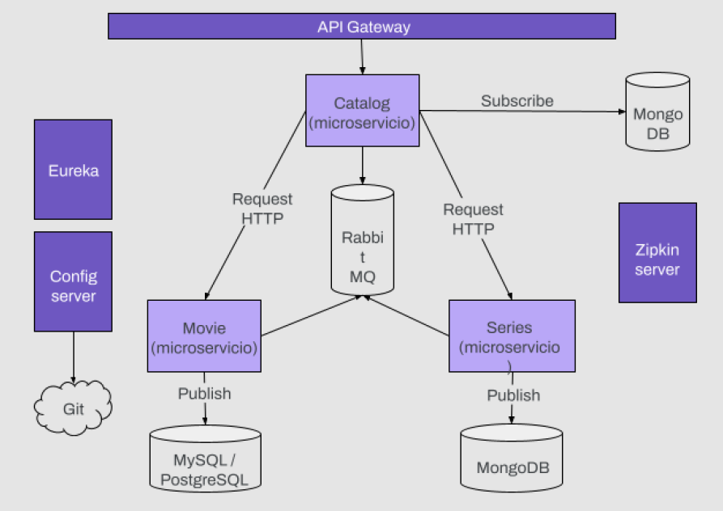

# Proyecto de Microservicios para la Especialización en BackEnd

Proyecto creado utilizando el framework de Spring (Spring Boot y Spring Cloud) para Java.

## Descripción

Este proyecto consiste en una arquitectura de microservicios implementada utilizando diversas tecnologías y patrones como Eureka, Gateway, Config Server, RabbitMQ, Feign, Circuit Braker, Load Balancer y Zipkin. Además, se utiliza Docker para gestionar contenedores de MySQL y MongoDB, facilitando así la configuración del entorno de desarrollo y despliegue del sistema.

## Tecnologías Utilizadas

- Eureka: Servicio de registro y descubrimiento de microservicios.
- Gateway: Enrutamiento y balanceo de carga.
- Config Server: Servidor de configuración centralizada.
- RabbitMQ: Cola de mensajes para la comunicación entre microservicios.
- Feign: Cliente HTTP declarativo para simplificar la integración entre microservicios.
- Zipkin: Herramienta de trazabilidad para el seguimiento y monitoreo de las solicitudes.
- Circuit Breaker: Patrón de diseño que mejora la resiliencia de los sistemas al detectar y manejar fallos en la comunicación entre servicios.
- Load Balancer: Herramienta para distribuir la carga de trabajo entre múltiples instancias de un servicio para mejorar el rendimiento y la disponibilidad.
- Docker: Plataforma de contenedores para la gestión de MySQL y MongoDB.

## Ventajas de una Arquitectura de Microservicios

Algunas ventajas de utilizar una arquitectura de microservicios son:

- **Escalabilidad:** Permite escalar cada servicio de manera independiente, lo que facilita la gestión de la carga y optimiza el uso de recursos.

- **Despliegue Independiente:** Cada microservicio puede ser desarrollado, probado y desplegado de forma independiente, lo que agiliza el ciclo de desarrollo y mejora la flexibilidad del sistema.

- **Resiliencia:** Los microservicios están diseñados para ser tolerantes a fallos. Un fallo en un microservicio no afecta necesariamente a otros servicios, lo que reduce la probabilidad de fallos catastróficos en todo el sistema.

- **Facilidad de Mantenimiento:** La modularidad de los microservicios facilita la comprensión del sistema y permite realizar cambios y actualizaciones de manera más segura y rápida.

- **Tecnología Apropiada:** Cada microservicio puede ser desarrollado utilizando la tecnología más adecuada para su función específica, lo que permite utilizar diferentes lenguajes de programación, bases de datos, etc., según sea necesario.

- **Mejora en la Colaboración:** Favorece la colaboración entre equipos de desarrollo al dividir el sistema en componentes más pequeños y manejables.

- **Mejora en el Tiempo de Lanzamiento al Mercado:** La capacidad de desarrollar, probar y desplegar servicios de forma independiente permite acelerar el tiempo de lanzamiento al mercado de nuevas funcionalidades.

- **Mayor Adaptabilidad:** Permite una mayor adaptabilidad a medida que los requisitos del negocio cambian con el tiempo, ya que cada microservicio puede evolucionar de forma independiente.

Estas son solo algunas de las ventajas clave de utilizar una arquitectura de microservicios en el desarrollo de aplicaciones.

## Ventajas de usar Spring para Microservicios en Java

Spring es un framework de desarrollo de aplicaciones Java ampliamente utilizado que proporciona numerosas ventajas al trabajar con microservicios:

- **Facilidad de Desarrollo:** Spring Boot simplifica la configuración y el desarrollo de microservicios al proporcionar un conjunto de convenciones y configuraciones por defecto, lo que reduce la cantidad de código boilerplate necesario.

- **Inyección de Dependencias:** Spring Framework facilita la inyección de dependencias, lo que mejora la modularidad y la flexibilidad del código al permitir la gestión de dependencias de forma más eficiente.

- **Soporte para APIs REST:** Spring Framework ofrece un conjunto completo de herramientas para desarrollar APIs RESTful de manera eficiente, incluyendo Spring MVC y Spring Data REST.

- **Integración con Otras Tecnologías:** Spring proporciona una amplia gama de proyectos y extensiones que facilitan la integración con otras tecnologías comúnmente utilizadas en el desarrollo de microservicios, como Spring Cloud, Spring Security, Spring Data, entre otros.

- **Soporte Activo y Comunidad Vibrante:** Spring es respaldado por una comunidad activa de desarrolladores y cuenta con un amplio soporte a través de documentación detallada, tutoriales y recursos en línea, lo que facilita el aprendizaje y la resolución de problemas.

- **Escalabilidad y Rendimiento:** Spring Boot y Spring Cloud ofrecen características y herramientas para gestionar la escalabilidad y mejorar el rendimiento de los microservicios, como el balanceo de carga, el descubrimiento de servicios, el circuit breaker, entre otros.

- **Testing Simplificado:** Spring Framework proporciona herramientas integradas para escribir pruebas unitarias y de integración de manera sencilla, lo que facilita la implementación de prácticas de desarrollo ágil como TDD (Test-Driven Development) y BDD (Behavior-Driven Development).

- **Facilidad de Configuración y Gestión:** Spring Boot simplifica la configuración y gestión de microservicios al ofrecer características como la autoconfiguración y la gestión de propiedades externas, lo que facilita la implementación de diferentes entornos (desarrollo, prueba, producción, etc.).

Estas son solo algunas de las ventajas clave de usar Spring para el desarrollo de microservicios en Java.

## Requisitos

- JDK (Java Development Kit)
- Maven
- Docker

## Configuración

1. Clona este repositorio: `git clone https://github.com/tu-usuario/tu-repositorio.git`
2. Abre el proyecto en tu IDE preferido como IntelliJ por ejemplo.
3. Inicia los servicios de Eureka, Gateway, Config Server, RabbitMQ y Zipkin.
4. Construye y despliega cada microservicio según sea necesario.
5. Ejecuta los contenedores de MySQL y MongoDB utilizando Docker.

